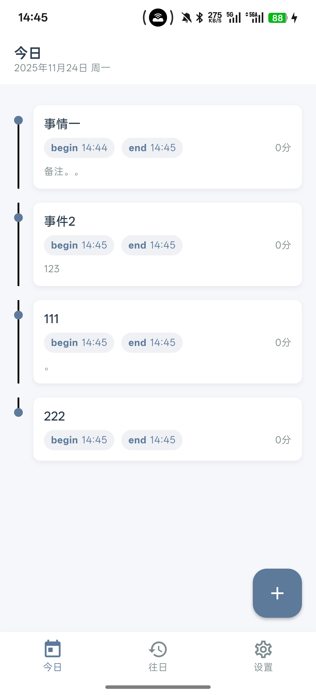
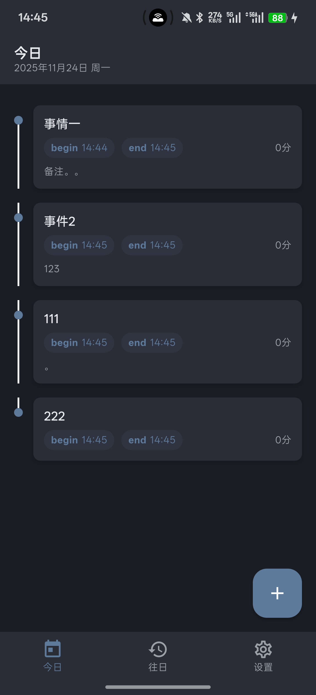
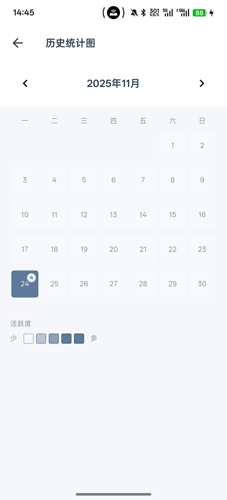
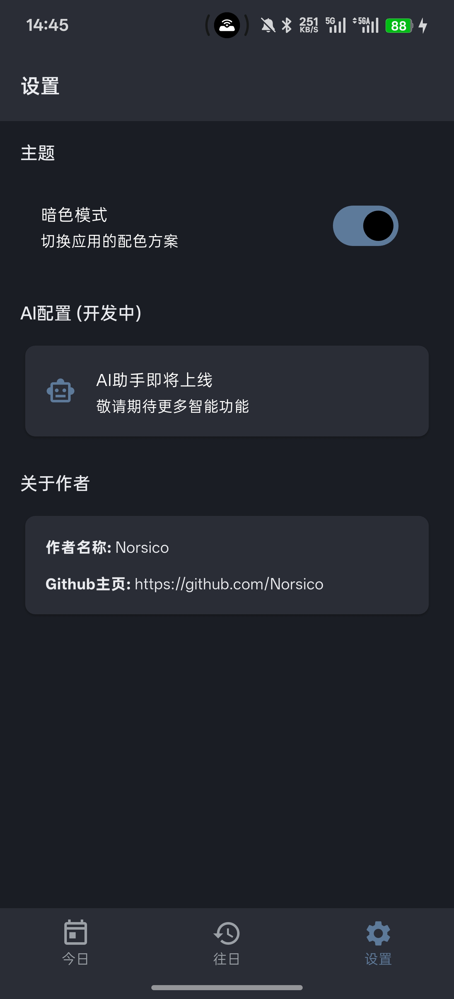

# DayDream

一个简洁优雅的时间记录应用，帮助你记录每天的活动，方便后期复盘。

## 功能特性

### 今日
- 以时间线方式展示当天的所有事件
- 快速开始新事件记录
- 标记事件开始和结束时间
- 添加备注和感悟

### 往日
- 查看历史记录
- 按周和月分组显示
- 查看特定日期的详细事件

### 设置
- 支持深色/浅色主题切换
- AI配置（开发中）
- 关于作者

## 技术栈

- Flutter SDK 3.7.2
- Hive - 本地数据存储
- Provider - 状态管理
- Material Design 3

## 运行项目

```bash
flutter pub get
flutter run
```

## 截图预览

| | | |
| --- | --- | --- |
|  |  |  |
|  |  |  |

## 作者

**Norsico**
- GitHub: https://github.com/Norsico


